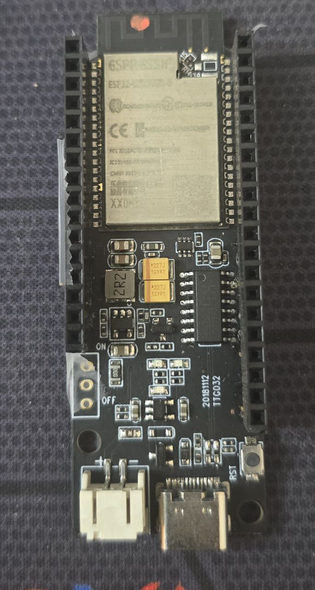
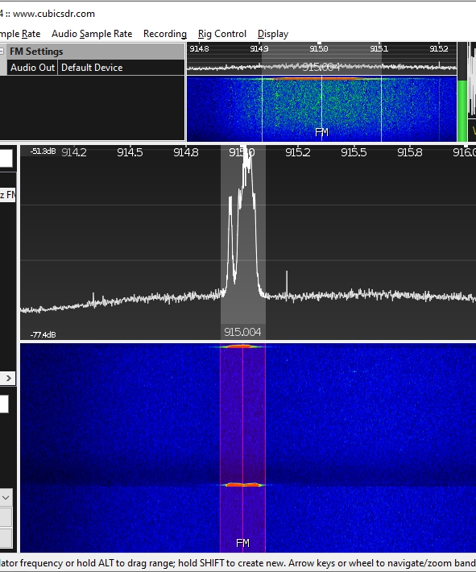
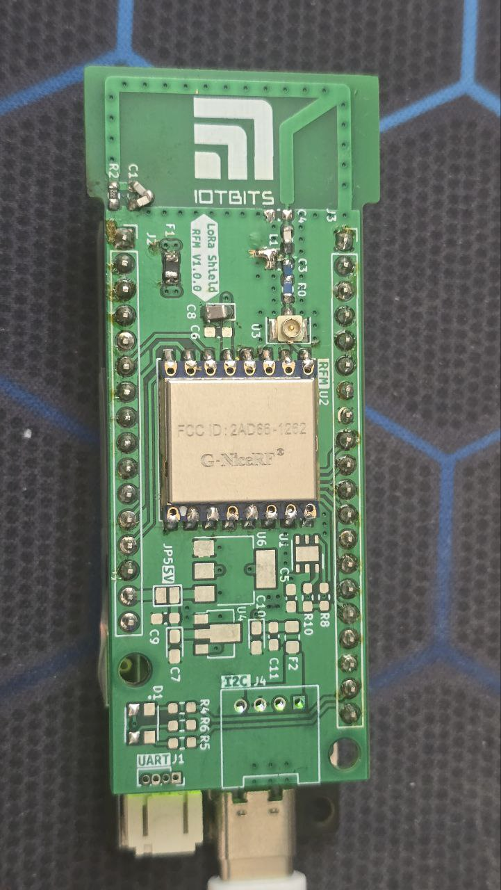
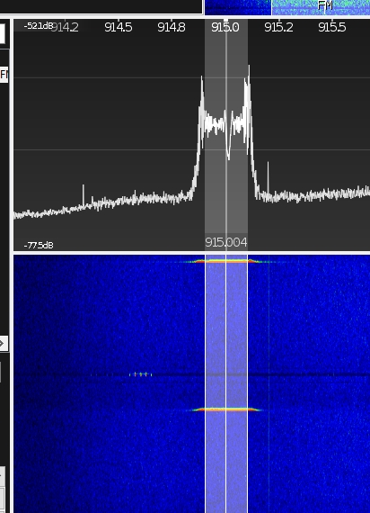

# NiceRF SX1262 RadioLib Ping-Pong Example

This project demonstrates a ping-pong communication example using the NiceRF SX1262 LoRa radio module with the **RadioLib library** on ESP32 development boards. This implementation uses the modern RadioLib instead of the original NiceRF library, providing better cross-platform compatibility and advanced features.

**Official Product Page:** https://www.nicerf.com/lora-module/915mhz-lora-module-lora1262.html

## Overview

This example creates a simple point-to-point communication system between two SX1262 radios using the RadioLib library. One device acts as the initiating node (sender) that periodically transmits packets, while the other acts as a receiving node that listens and responds to incoming packets.

### Features

- **RadioLib Integration**: Modern cross-platform LoRa library with extensive protocol support
- LoRa communication at 434.5 MHz or 915 MHz (configurable)
- Support for multiple ESP32 board types (ESP32 Dev Board and ESP32-WROVER-B)
- Configurable transmission power (-9 to +22 dBm)
- Multiple spreading factors (SF6 to SF12)
- Various bandwidth options (7.8 kHz to 500 kHz)
- Coding rates from 4/5 to 4/8
- Automatic ping-pong operation with signal quality reporting (RSSI, SNR)

## Hardware Requirements

## Hardware Requirements

### Components
- 2x ESP32 development boards
- 2x NiceRF SX1262 LoRa modules
- Jumper wires
- Breadboard (optional)

### ESP32-WROVER-B Development Kit
This project is optimized for the ESP32-WROVER-B development kit:



*ESP32-WROVER-B development kit used in this project*

### NiceRF SX1262 Module
The project uses the NiceRF SX1262 160mW LoRa module:



*NiceRF SX1262 160mW LoRa module with excellent range and power efficiency*

### Custom PCB Shield
For ESP32-WROVER-B users, a custom shield PCB is available that simplifies connections:



*Custom PCB shield designed for ESP32-WROVER-B with integrated SX1262 module connections*

### Supported Boards
- ESP32 Dev Board
- ESP32-WROVER-B Dev Board (default configuration)

### Radio Module
- NiceRF SX1262 LoRa module

### Pin Connections

The project supports two ESP32 board configurations with different pin mappings:

#### Configuration 1: ESP32 Dev Board (Alternative)
To use this configuration, uncomment `#define ESP32DEV_BOARD` in main.cpp

| ESP32 Pin | SX1262 Pin | Function |
|-----------|------------|----------|
| GPIO5     | NSS        | SPI Chip Select |
| GPIO18    | SCK        | SPI Clock |
| GPIO23    | MOSI       | SPI Master Out |
| GPIO19    | MISO       | SPI Master In |
| GPIO16    | NRESET     | Reset Pin |
| GPIO21    | BUSY       | Busy Status |
| GPIO17    | DIO1       | Digital I/O 1 |
| 3.3V      | VCC        | Power Supply |
| GND       | GND        | Ground |

#### Configuration 2: ESP32-WROVER-B Dev Board (Current Default)
To use this configuration, uncomment `#define ESP32WROOM_DEV_BOARD` in main.cpp

| ESP32 Pin | SX1262 Pin | Function |
|-----------|------------|----------|
| GPIO5     | NSS        | SPI Chip Select |
| GPIO18    | SCK        | SPI Clock |
| GPIO23    | MOSI       | SPI Master Out |
| GPIO19    | MISO       | SPI Master In |
| GPIO4     | NRESET     | Reset Pin |
| GPIO12    | BUSY       | Busy Status |
| GPIO14    | DIO1       | Digital I/O 1 |
| 3.3V      | VCC        | Power Supply |
| GND       | GND        | Ground |

⚠️ **IMPORTANT**: Ensure the power supply is **UNDER 3.3V**. Higher voltages will damage the module!

## Software Requirements

- PlatformIO IDE
- RadioLib library (v6.6.0 or later)
- ESP32 Arduino framework

### Project Structure
```
NiceRF_SX1262_RadioLib/
├── platformio.ini          # PlatformIO configuration
├── src/
│   └── main.cpp            # Main application code
├── img/                    # Project images and documentation
│   ├── ESP32wroverkit.jpg
│   ├── NiceRF_SX1262_ESP32WROOM.jpg
│   └── NiceRF_Sx1262_160mw.jpg
└── README.md               # This file
```

## Configuration

## Configuration

### Board Selection
Choose your ESP32 board type by uncommenting the appropriate define in `main.cpp`:
```cpp
// Option 1: ESP32 Dev Board (uses GPIO16, GPIO21, GPIO17)
//#define ESP32DEV_BOARD

// Option 2: ESP32-WROVER-B Dev Board (uses GPIO4, GPIO12, GPIO14) - Default
#define ESP32WROOM_DEV_BOARD
```

### Frequency Configuration
Choose the appropriate frequency for your region:
```cpp
//#define FREQUENCY 434.5 // 434.5MHz - Europe/Asia ISM band
#define FREQUENCY 915.0   // 915MHz - Americas ISM band
```

### Node Configuration
To set up the initiating node (sender), uncomment:
```cpp
#define INITIATING_NODE
```

For the receiving node, comment out or remove this line.

### LoRa Parameters
The following parameters can be adjusted in `main.cpp`:

| Parameter | Default Value | Description | Available Options |
|-----------|---------------|-------------|-------------------|
| `FREQUENCY` | 915.0 MHz | Operating frequency | 434.5 MHz (EU/Asia), 915.0 MHz (Americas) |
| `POWER` | 10 dBm | Transmission power | -9 to 22 dBm |
| `TCXO_VOLTAGE` | 3.3V | TCXO reference voltage | 1.8V or 3.3V |
| `BANDWIDTH` | 250.0 kHz | Signal bandwidth | 7.8, 10.4, 15.6, 20.8, 31.25, 41.7, 62.5, 125, 250, 500 kHz |
| `SPREADING_FACTOR` | 8 | LoRa spreading factor | 6-12 |
| `CODING_RATE` | 5 | Coding rate | 5 (4/5), 6 (4/6), 7 (4/7), 8 (4/8) |
| `TRANSMIT_INTERVAL` | 10000ms | Time between transmissions | Any value in milliseconds |

### Node Configuration
To set up the initiating node (sender), uncomment:
```cpp
#define INITIATING_NODE
```

For the receiving node, comment out or remove this line.

## Building and Testing

### Step 1: Setup Initiating Node (Sender)

1. Open the project in PlatformIO
2. Ensure the `INITIATING_NODE` define is uncommented in `main.cpp`:
   ```cpp
   #define INITIATING_NODE
   ```
3. Configure the upload port in `platformio.ini`:
   ```ini
   upload_port = COM4  ; Adjust to your port
   monitor_port = COM4
   ```
4. Build and upload to the first ESP32:
   ```bash
   pio run -t upload
   ```

### Step 2: Setup Receiving Node (Listener)

1. Comment out the `INITIATING_NODE` define in `main.cpp`:
   ```cpp
   //#define INITIATING_NODE
   ```
2. Build and upload to the second ESP32:
   ```bash
   pio run -t upload
   ```

### Step 3: Testing

1. **Connect both devices** to their respective serial monitors (115200 baud)

2. **Power on both devices**
   - Initiating node should display: "NiceRF [SX1262] RadioLib Initializing ... success!"
   - Receiving node should display: "NiceRF [SX1262] RadioLib Initializing ... success!"

3. **Observe communication**
   - Initiating node transmits "Hello World!" every 10 seconds
   - Receiving node receives and displays the data with RSSI and SNR values

### RF Signal Verification
You can verify the LoRa transmission using an SDR (Software Defined Radio). Below is an example capture showing the LoRa signal:



*SDR capture showing LoRa signal transmission at the configured frequency using RadioLib*

## How It Works

### Initiating Node (Sender)
- Initializes the SX1262 radio with configured parameters
- Sends a "Hello World!" packet every 10 seconds
- Switches to receive mode after each transmission
- Displays received acknowledgments and signal quality

### Receiving Node (Listener)
- Initializes the SX1262 radio with the same parameters
- Continuously listens for incoming packets
- Displays received data along with RSSI and SNR values
- Can be configured to send responses back

### Communication Flow
1. Initiating node sends a packet
2. Receiving node receives and processes the packet
3. Both nodes display transmission/reception status
4. Signal quality metrics (RSSI, SNR) are shown
5. Process repeats at the configured interval

## Serial Monitor Output

**Expected Initiating Node Output:**
```
NiceRF [SX1262] RadioLib Initializing ... success!
[SX1262] Sending first packet ...
[SX1262] Transmission finished!
[SX1262] Sending scheduled packet ...
[SX1262] Transmission finished!
```

**Expected Receiving Node Output:**
```
NiceRF [SX1262] RadioLib Initializing ... success!
[SX1262] Starting to listen ... success!
[SX1262] Received packet!
[SX1262] Data:       Hello World!
[SX1262] RSSI:       -45 dBm
[SX1262] SNR:        9.75 dB
[SX1262] Received packet!
[SX1262] Data:       Hello World!
[SX1262] RSSI:       -47 dBm
[SX1262] SNR:        8.25 dB
```

## Troubleshooting

### Common Issues

1. **"failed, code" message during initialization**
   - Check wiring connections (verify you're using the correct pin configuration for your board)
   - Verify power supply is 3.3V
   - Ensure SX1262 module is properly seated
   - Check that the correct board configuration is selected in code

2. **No communication between devices**
   - Verify both devices use the same LoRa parameters (frequency, SF, BW, CR)
   - Ensure both devices use the same frequency (434.5 MHz or 915 MHz)
   - Check antenna connections
   - Ensure adequate distance (but not too far for initial testing)
   - Verify both devices are using compatible pin configurations

3. **Compilation errors**
   - Verify PlatformIO ESP32 platform is installed
   - Check that RadioLib dependency is properly installed
   - Ensure only one board configuration is uncommented

### Debug Tips

- Enable debug output by checking the build flags in `platformio.ini`
- Use an oscilloscope to verify SPI communication
- Test with devices close together initially
- Monitor serial output on both devices simultaneously
- Verify the correct board configuration is selected before testing
- Ensure both devices use the same frequency setting

### Error Codes
RadioLib returns specific error codes for debugging. Common codes:
- `RADIOLIB_ERR_NONE` (0): Success
- Negative values indicate specific errors (check RadioLib documentation)

## Frequency Band Selection

This project supports two common LoRa frequency bands:

- **434.5 MHz**: ISM band commonly used in Europe and Asia
- **915 MHz**: ISM band commonly used in Americas

⚠️ **Important**: Ensure you're using the appropriate frequency for your region and comply with local regulations.

## Customization

### Changing Transmission Content
Modify the transmission string in the loop function:
```cpp
transmissionState = radio.startTransmit("Your custom message!");
```

### Adjusting Transmission Interval
Change the `TRANSMIT_INTERVAL` define:
```cpp
#define TRANSMIT_INTERVAL 5000UL  // 5 seconds
```

### Adding Bidirectional Communication
Remove the `INITIATING_NODE` define and implement custom logic for both sending and receiving on both nodes.

## License

This project is based on the RadioLib examples and is provided as-is for educational and development purposes.

## Upcoming Project with NiceRF SX1262

### LoRa Dual Motion Sensor

We're developing an advanced LoRa-based dual motion sensor system using the NiceRF SX1262 module with ESP32-C3. This project will feature:

- **Dual Motion Detection**: Multiple motion sensors for enhanced coverage
- **Low Power Design**: Optimized for battery operation
- **Compact Form Factor**: Custom PCB design for minimal footprint
- **ESP32-C3 Integration**: Latest ESP32 variant with built-in RISC-V processor
- **RadioLib Integration**: Modern library support for enhanced compatibility

#### 3D PCB Preview

**Front View:**


**Back View:**


*3D render of the upcoming LoRa Dual Motion Sensor PCB featuring NiceRF SX1262 and ESP32-C3*

This upcoming project will demonstrate advanced applications of the SX1262 module in IoT sensing applications with long-range wireless communication capabilities using the RadioLib framework.

## References

- [RadioLib Documentation](https://jgromes.github.io/RadioLib/)
- [RadioLib Default Configuration](https://github.com/jgromes/RadioLib/wiki/Default-configuration#sx126x---lora-modem)
- [SX126x Datasheet](https://www.semtech.com/products/wireless-rf/lora-connect/sx1262)
- [NiceRF Module Documentation](https://www.nicerf.com/)
- [PlatformIO Documentation](https://docs.platformio.org/)
- [ESP32 Arduino Core](https://github.com/espressif/arduino-esp32)
